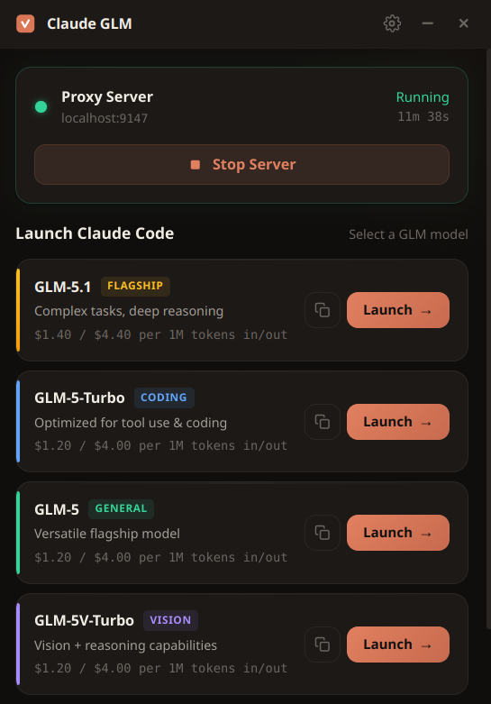

<div align="center">

# Claude GLM

**Claude Code thinks it's talking to Anthropic. GLM handles the rest.**

Use Z.AI GLM models inside Claude Code — no modifications, no plugins, no config files. One proxy that rewrites one header. That's the entire translation layer.

[](LICENSE)
[](https://nodejs.org)

```bash
git clone https://github.com/pigo/claude-glm.git && cd claude-glm
export ZAI_API_KEY="your-key-here"
./claude-glm.sh
```

[Get a Z.AI API key](https://open.bigmodel.cn/usercenter/apikeys) &middot; Works on Mac, Windows, and Linux

</div>

---

```
Claude Code ──► claude-glm proxy ──► api.z.ai ──► GLM models
              localhost:9147         (unchanged)
```

Claude Code sends `x-api-key`. Z.AI expects `Authorization: Bearer`. The proxy rewrites the header and pipes everything else through unchanged — streaming, tools, system prompts, the whole thing.

---

## Quick Start

```bash
# 1. Clone
git clone https://github.com/pigo/claude-glm.git && cd claude-glm

# 2. Set your API key
export ZAI_API_KEY="your-key-here"

# 3. Launch
./claude-glm.sh
```

You're running GLM-5.1. Type "What model are you?" to confirm.

**Pick a model:**

```bash
./claude-glm.sh glm-5.1           # strongest
./claude-glm.sh glm-5-turbo       # best for coding
./claude-glm.sh glm-4.7-flash     # free tier
```

**Install system-wide:**

```bash
./install.sh
claude-glm glm-5.1
```

---

## Models

| Model | Speed | Price | Best For |
|-------|-------|-------|----------|
| **GLM-5.1** | Fast | $1.40 / $4.40 | Complex tasks, deep reasoning |
| **GLM-5-Turbo** | Faster | $1.20 / $4.00 | Coding, tool use |
| **GLM-5** | Fast | $1.20 / $4.00 | General flagship |
| **GLM-5V-Turbo** | Fast | $1.20 / $4.00 | Vision + reasoning |
| **GLM-4.7** | Medium | $0.50 / $1.50 | Solid all-rounder |
| **GLM-4.7-FlashX** | Fast | $0.10 / $0.30 | Cheapest paid |
| **GLM-4.7-Flash** | Fast | **Free** | Quick tasks, testing |

Prices per 1M tokens (input/output). Billed by Z.AI, not Anthropic.

---

## Desktop App

A system tray app that manages the proxy and launches Claude Code from a GUI. No terminal needed to start.

<p align="center"></p>

```bash
./claude-glm-app.sh
```

**Features:**
- System tray with proxy status (live dot + uptime)
- One-click model launch (detects Ghostty, Kitty, Alacritty, GNOME Terminal, Konsole)
- Copy button on each model — paste the command in any terminal, any directory
- API key management in Settings
- Auto-starts proxy on demand

**Config** stored at `~/.config/claude-glm/config.json` — or set via the Settings panel.

---

## What Works

- Streaming responses
- Multi-turn conversations
- All tools (Bash, Read, Write, Edit, Glob, Grep, WebSearch, WebFetch)
- Tool use / function calling
- System prompts (CLAUDE.md, hooks)
- Hooks, Skills, Agents, slash commands
- Parallel tool execution
- Vision (use `glm-5v-turbo`)
- Compaction (uses the active GLM model)

---

## Configuration

| Variable | Default | Description |
|----------|---------|-------------|
| `ZAI_API_KEY` | — | Your Z.AI API key (required) |
| `ANTHROPIC_BASE_URL` | `http://localhost:9147` | Set automatically by launch scripts |
| `ANTHROPIC_API_KEY` | `$ZAI_API_KEY` | Set automatically by launch scripts |

**Persist your key** — add to `~/.bashrc` or `~/.zshrc`:

```bash
export ZAI_API_KEY="your-key-here"
```

**Network allowlist** — if Claude Code blocks `api.z.ai`, add to `~/.claude/settings.json`:

```json
{
  "network": {
    "allowedDomains": ["api.z.ai", "z.ai"]
  }
}
```

---

<details>
<summary><strong>How It Works</strong></summary>

The entire proxy is 87 lines of Node.js with zero dependencies beyond the standard library.

```
Claude Code → proxy.js (:9147) → api.z.ai/api/anthropic → GLM
```

1. Claude Code sends a request with `x-api-key: <key>` header
2. The proxy rewrites it to `Authorization: Bearer <key>`
3. Everything else — body, streaming, tools — passes through unchanged
4. Z.AI's `/api/anthropic` endpoint speaks native Anthropic protocol, so no format translation is needed

That's it. One header rewrite. Read `proxy.js` — it's the whole thing.

</details>

<details>
<summary><strong>Known Limitations</strong></summary>

| Feature | Status | Notes |
|---------|--------|-------|
| Thinking blocks | Partial | GLM returns `reasoning_content` instead of Anthropic `thinking` blocks |
| Prompt caching | May differ | Z.AI has its own caching; Anthropic cache tokens may not map 1:1 |
| Model fallback | No cross-fallback | If GLM returns 529, Claude Code may try a Claude model |
| Max output tokens | Works | GLM-5 series supports up to 128K output |

</details>

<details>
<summary><strong>Troubleshooting</strong></summary>

**"Invalid API key"** — proxy isn't running or env vars aren't set. Check:
```bash
curl http://localhost:9147/    # should return something, not connection refused
```

**"unknown certificate verification error"** — the proxy needs TLS relaxed for the localhost connection. Use `claude-glm.sh` which handles this, or set `NODE_TLS_REJECT_UNAUTHORIZED=0` manually.

**"There's an issue with the selected model"** — `ANTHROPIC_BASE_URL` isn't reaching the proxy. Env vars must be on the **same line** as the `claude` command:
```bash
# Wrong (zsh may split the line)
ANTHROPIC_BASE_URL=http://localhost:9147 \
  claude --model glm-5.1

# Correct
ANTHROPIC_BASE_URL=http://localhost:9147 ANTHROPIC_API_KEY=$ZAI_API_KEY claude --model glm-5.1
```

**"Auth conflict: Both a token and an API key"** — you're logged into claude.ai AND set `ANTHROPIC_API_KEY`. Run `claude /logout` first.

**Port 9147 already in use** — `fuser -k 9147/tcp`

</details>

---

## File Structure

```
claude-glm/
├── proxy.js              ← The proxy (87 lines)
├── claude-glm.sh         ← CLI launcher
├── claude-glm-app.sh     ← Desktop app launcher
├── install.sh            ← System-wide installer
└── app/                  ← Electron desktop app
    ├── main.js
    ├── preload.js
    ├── package.json
    └── renderer/
        ├── index.html
        ├── app.js
        └── styles.css
```

---

## Security

- API key lives in env vars only — never written to disk by the proxy
- Proxy listens on `localhost:9147` only — not exposed to the network
- `NODE_TLS_REJECT_UNAUTHORIZED=0` is needed because the proxy intercepts the connection; the upstream connection to `api.z.ai` is still encrypted

---

## License

MIT
